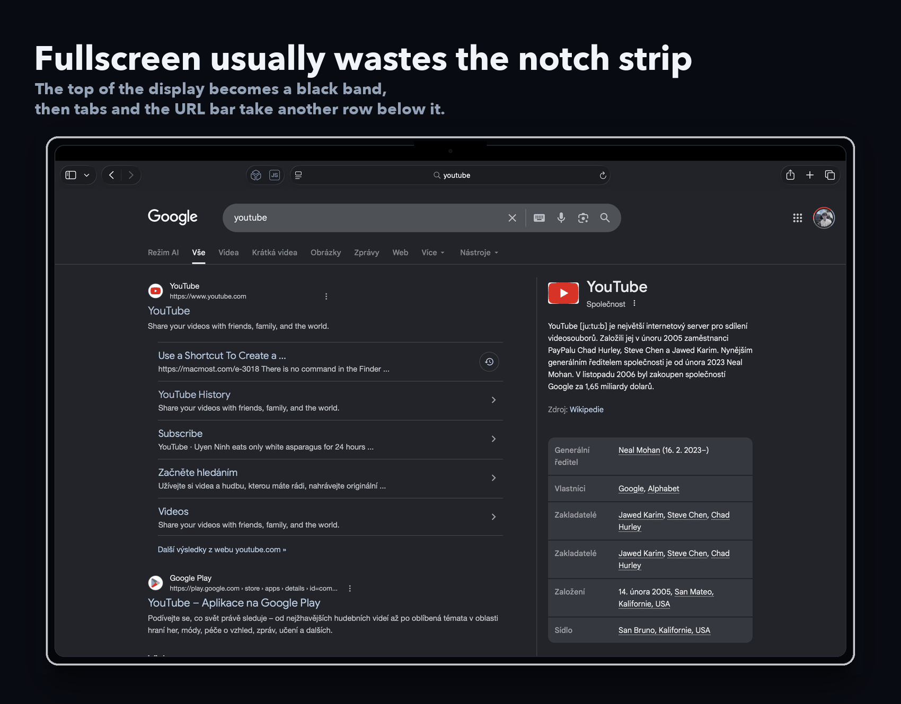
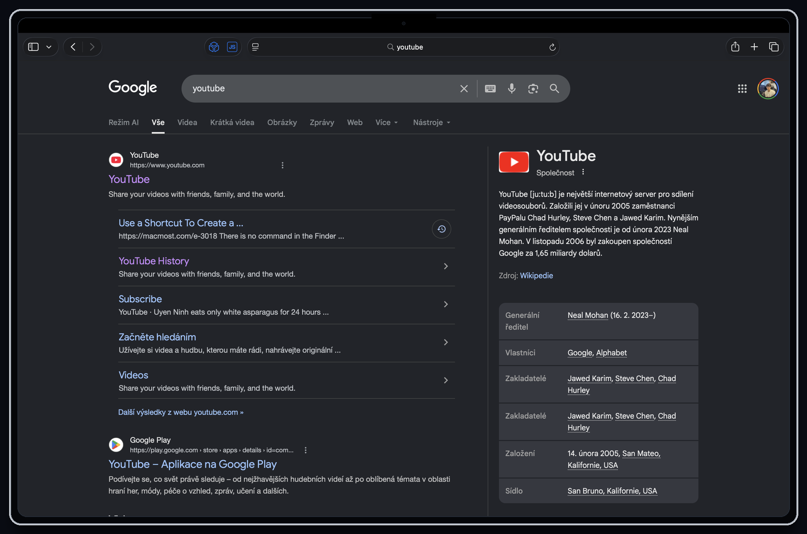
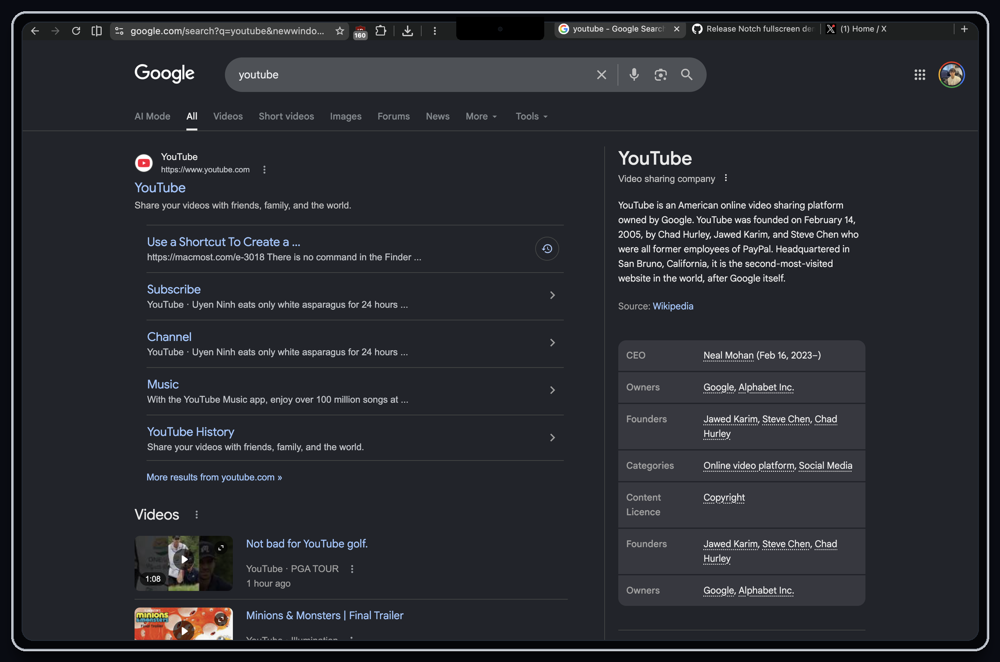

# Helium Notch Fullscreen Fork

An experimental macOS fork of
[Helium Browser](https://github.com/imputnet/helium). This is not an official
Helium release; it is my notch-focused build for MacBooks with a camera cutout.

The fork uses the display area around the MacBook notch for browser tabs and
controls instead of leaving it as dead black space.

<p align="center">
  
</p>

## What this changes

Most browsers still treat fullscreen on notched MacBooks as if the notch strip
cannot be used. The result is a black band at the top of the display, then a
second row for tabs and the URL bar, and only then the actual page.

This fork moves the browser chrome into that otherwise wasted strip. Tabs, the
toolbar, window controls, and the URL field are arranged around the camera
cutout, while web content stays safely below it. The page gets more vertical
room without hiding anything behind the notch.

The animation above is generated from the real fullscreen screenshots in this
repo, with a consistent programmatic MacBook outline and notch overlay so the
before/after geometry stays honest.

## Implementation

In this fork, the feature is enabled by default for ordinary browser fullscreen
on supported MacBook displays. The `--helium-notch-fullscreen` switch is still
accepted for explicit testing, but release builds from this fork do not require
it.

When the user enters normal browser fullscreen, this fork creates a custom
borderless AppKit window instead of using native macOS fullscreen. The browser
chrome is laid out into the public AppKit
`NSScreen.safeAreaInsets`, `auxiliaryTopLeftArea`, and `auxiliaryTopRightArea`
regions. Web contents stay below the notch strip. Web page/video/tab fullscreen
and kiosk/locked fullscreen are left alone.

The implementation lives in the normal Helium patch workflow:

```text
patches/helium/macos/notch-aware-fullscreen-toolbar.patch
```

It adds a small macOS fullscreen controller, a geometry helper for notch metrics,
an optional `--helium-notch-fullscreen` switch, and gated layout changes for
BrowserView, the top container, toolbar, tab strip, window buttons, and content
rounding.
It uses public AppKit APIs only. No private macOS APIs, injection, SIP changes,
or global system hooks are used.

This is still a practical experiment, not a finished upstream feature. Feedback,
bug reports, design suggestions, and alternative implementation ideas are very
welcome.

### Before and after

For a static view, these are the two source states used in the hero animation.
They are framed with the same generated MacBook outline and notch overlay.

<table>
  <tr>
    <th>Before: normal fullscreen</th>
    <th>After: this Helium fork</th>
  </tr>
  <tr>
    <td></td>
    <td></td>
  </tr>
</table>

### Trying a release build

The latest `notch-fullscreen-demo-v0.4` release is source-only because GitHub
Actions are not registered on this fork right now. Build locally for a fresh
app bundle, or use an older release only if you specifically need a prebuilt
demo.

If a release includes `Helium.app.zip`, unzip it and open the app normally. To
keep the demo away from an existing browser profile, you can also run it with a
separate profile:

```sh
open -n /path/to/Helium.app --args \
  --user-data-dir="$HOME/Library/Application Support/Helium Notch Demo"
```

The separate `--user-data-dir` keeps the demo away from an existing browser
profile. After the app opens, press `Control-Command-F` to enter fullscreen.

Notes:

- A notched MacBook display is required to see the notch layout.
- Current local builds are Apple Silicon (`arm64`) unless built otherwise.
- The release zip must include Chromium runtime libraries inside the app bundle.
  If a downloaded build is around 50 MB or crashes with a missing
  `libc++_chrome.dylib`, download the current release asset again.
- Unsigned or ad-hoc signed builds may need right-click, then Open, the first
  time macOS launches them.

### Building this fork

```sh
mkdir -p ~/Code
cd ~/Code
git clone --recurse-submodules https://github.com/vvitovec/helium-macos.git
cd helium-macos
source dev.sh
he setup
he merge
he build
```

Run the local build:

```sh
open -n build/src/out/Default/Helium.app --args \
  --user-data-dir=/tmp/helium-notch-test
```

Regenerate the README visuals, including the animated GIF:

```sh
python3 docs/scripts/build_notch_readme_assets.py \
  --before /path/to/before-fullscreen.png \
  --after /path/to/helium-notch-fullscreen.png
```

## Building and development
macOS is our primary development platform, so it's the recommended environment
for developing new Helium features.

[> See docs/building.md](docs/building.md)

## Contributing
Before contributing to this repo, please read the guidelines in the main repo's
[CONTRIBUTING.md](https://github.com/imputnet/helium/blob/main/CONTRIBUTING.md).

## Credits

### Depot
Big thank you to [Depot](https://depot.dev/) for sponsoring our runners,
which handle the macOS builds of Helium. Their high-performance infrastructure
lets us compile, package, and release new builds of Helium within hours,
not days.

### ungoogled-chromium-macos
This repo is based on
[ungoogled-chromium-macos](https://github.com/ungoogled-software/ungoogled-chromium-macos),
but heavily modified for Helium. Special thanks to everyone behind
ungoogled-chromium, they made working with Chromium infinitely easier.

## License
All code, patches, modified portions of imported code or patches, and
any other content that is unique to Helium and not imported from other
repositories is licensed under GPL-3.0. See [LICENSE](LICENSE).

Any content imported from other projects retains its original license (for
example, any original unmodified code imported from ungoogled-chromium remains
licensed under their [BSD 3-Clause license](LICENSE.ungoogled_chromium)).
